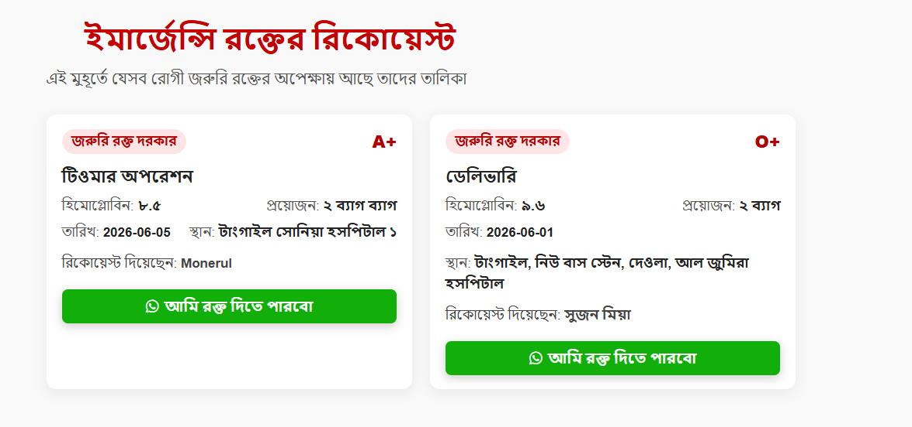

- https://www.bloodbank.org.bd/
- https://badhan.org/ 
- https://donatebloodbd.com/
- https://www.bloodbank.org.bd/
- https://eraktkosh.mohfw.gov.in/
- https://www.redcrossblood.org/

CLAUDE.md
আমার বর্তমান প্রজেক্ট অনেক সিম্পল, আমি চাচ্ছি বর্তমানে যেসব blood group registration, blood group finding site আছে, সেগুলো নিয়ে research করে একদম ফুল প্রফেশনাল মানের একটা blood finder bangladesh orginization বানাতে, যেটা মানুষ ভালো ভাবে রিয়েল লাইফে ইউজ করতে পারবে। 
বর্তমান সাইট গুলো তে কি কি মিসিং আছে, সেগুলো কীভাবে ভালোভাবে সল্ভ করা যায়, বর্তমান সাইট এর ফিচার গুলো কীভাবে ভালো করা যায়, সেটা নিয়ে রিসার্চ করবো, 
আমাদের সাইট টা কিভাবে ইম্প্রভ করা যায়, UI কীভাবে ইম্প্রভ করা যায়, সেগুলো নিয়ে research করবো। 

কি কি ভালো ফিচার দেয়া যায়? কি কি ইম্প্রুভ করা যায়? কোনো AI feature দেয়া যায় কিনা, সাইট টাকে animated/interactive করা যায় কিনা ( যেমনঃ উদাহরন হিসেবে বাংলাদেশ এর মাংচিত্রে কোন জায়গা থেকে কত জন ব্লাড ডনার আছে, কি কি গ্রুপ আছে সেটার সুন্দর একটা গ্রাফ দেখানো যায় )

প্রথমে অন্যদের এই ধরনের ওয়েবগুলো নিয়ে reserach করে সেগুলো একটা docs করা যায়। 

আমি যে সাইট গুলো দিছি, সেগুলো ছাড়াও বাকি কি সাইট দেখো ভালো কি আছে, বাইরের দেশের ভালো মানের সাইট দেখে ও আমরা রিসার্চ করতে পারি। 
বাইরের দেশে ব্লাড খুজে পাওয়ার সমস্যার সমাধান কীভাবে ভালো ভাবে সল্ভ করেছে, কীভাবে স্মার্ট উপায়ে এটা সল্ভ করেছে, এখানে ai কিভাবে হেল্প করতে পারে। 

আমাদের ওয়েবসাইট ঃ বাংলা ইংলিশ ২ টা মিক্সড থাকবে, Common Term গুলো থাকবে ইংলিশ এ । আর বর্ননা / ব্যাখা, যেখানে ইংলিশ টা কঠিন সেখানে বাংলা থাকবে । 

Blood Finder:
    Home Page: 
আপনার কি রক্তের প্রয়োজন? রক্তদাতা খুঁজছেন?
নিজের রক্তের গ্রুপের তথ্য দিন এবং প্রয়োজনে রক্ত দাতার তথ্য নিন।
রক্তদানে এগিয়ে আসুন
রক্ত কৃত্তিমভাবে তৈরী করা যায় না, শুধুমাত্র একজন মানুষই পারে রক্তদানের মাধ্যমে অন্য মানুষের জীবন বাঁচাতে। কিন্তু দুঃখের ব্যাপার, প্রতিবছর বহুসংখ্যক মানুষ মারা যাচ্ছে জরুরি মুহুর্তে প্রয়োজনীয় রক্তের অভাবে। জনবহুল এই দেশে এখনো মানুষ মারা যাচ্ছে রক্তের অভাবে। রক্তের এই চাহিদা খুব সহজেই পূরণ করা সম্ভব হবে যদি আমাদের দেশের সকল প্রান্তের পূর্ণবয়স্ক মানুষদের রক্তদানের প্রয়োজনীয়তা এবং সুফলতা বুঝিয়ে সচেতন করা যায়।

একজন মুমূর্ষু রোগীকে তার প্রিয়জনের মাঝে সুস্থভাবে ফিরিয়ে আনা থেকে আনন্দের আর কিছু হতে পারে না। জরুরি রক্তের প্রয়োজনে মুমূর্ষু রোগীদের পাশে থাকুন। যারা রক্তদানে ইচ্ছুক, এই ওয়েবসাইটটিতে রক্তদাতা হিসাবে রেজিস্ট্রেশন করুন। জরুরি রক্তের প্রয়োজনে রোগীরাই আপনাকে খুঁজে নিবে।

রক্তদান ঐচ্ছিক বিষয় নয়, এটি দায়িত্বের চেয়েও বেশি কিছু

কেন রক্তদান করবেন?
প্রথম এবং প্রধান কারণ, আপনার দানকৃত রক্ত একজন মানুষের জীবন বাঁচাবে। রক্তদানের জন্য এর থেকে বড় কারণ আর কি হতে পারে!
হয়তো একদিন আপনার নিজের প্রয়োজনে/বিপদে অন্য কেউ এগিয়ে আসবে।
নিয়মিতরক্তদানেহৃদরোগ ও হার্ট অ্যাটাকের ঝুঁকি অনেক কম।

কারা রক্তদান করতে পারবেন?
১৮ বছর থেকে ৬০ বছরের যেকোনো সুস্থদেহের মানুষ রক্ত দান করতে পারবেন।
শারীরিক এবং মানসিক ভাবে সুস্থ নিরোগ ব্যক্তি রক্ত দিতে পারবেন।
আপনার ওজন অবশ্যই ৫০ কিলোগ্রাম কিংবা তার বেশি হতে হবে।
চার (৪) মাস অন্তর অন্তর রক্তদান করা যায়

কিছু ভুল ধারনা
রক্ত দান করার সময় মোটেও ব্যথা লাগে না। শুধুমাত্র সূচ ফোটানোর সময় অল্প একটু অস্বস্তি লাগে।
রক্তদানের পর স্বাস্থ্য খারাপ হয়ে যাবে – এটি ভুল ধারণা। আসলে রক্তদান করলে হৃদরোগের ঝুঁকি কমে এবং দেহে মাত্রাতিরিক্ত আয়রন বা লৌহ সঞ্চয় প্রতিরোধ করে।
ডায়াবেটিসে আক্রান্ত ব্যক্তি রক্ত দিতে পারবে না – এটিও ভুল ধারণা। স্বাস্থ্য পরীক্ষায় যোগ্য বিবেচিত হলে…

মনে করেন, কেউ একজন ঢাকা মহাখালি ব্লাড লাগবে বলে রিকুয়েস্ট রেখেছে, আমিও ঢাকা মহাখালী তে ব্লাড ডোনার হিসেবে রেজিস্ট্রেশন করেছি, তাইলে আমি আমার এলাকায় কার রক্ত লাগবে সেটা দেখতে পারবো, বা তুমি এই ধরনের একটা ফিচার ডিজাইন করতে পারো । 

রক্তদান: জীবন বাঁচানোর এক মহৎ উদ্যোগ
রক্তদান হল মানবতার প্রতি এক অসীম দায়িত্ববোধ ও সহানুভূতির প্রতীক। এটি এমন একটি প্রক্রিয়া যার মাধ্যমে একজন সুস্থ মানুষ নিজের শরীর থেকে নির্দিষ্ট পরিমাণ রক্ত দান করে, যা অন্যের জীবন রক্ষা করতে ব্যবহৃত হয়। রক্তদানের ফলে একজন অসুস্থ রোগী বা অপারেশনরত ব্যক্তি পুনরায় সুস্থ জীবনে ফিরে আসতে পারে।

রক্তদানের উপকারিতা
রক্তদান একটি জীবন রক্ষাকারী মহৎ কাজ। এটি অন্যের জীবন বাঁচানোর পাশাপাশি রক্তদাতার স্বাস্থ্যের জন্যও উপকারী। রক্তদান করলে হৃদরোগের ঝুঁকি কমে, শরীরে নতুন রক্তকোষ তৈরি হয়, ওজন নিয়ন্ত্রণে থাকে এবং মানসিক প্রশান্তি পাওয়া যায়। আপনার এক ব্যাগ রক্তে তিনজন মানুষের জীবন রক্ষা করা সম্ভব। আজই রক্তদান করে জীবন বাঁচানোর অংশীদার হোন!

Login / Registration : একজন ইজার বেসিক ইনফো দিয়ে রেজিস্ট্রেশন করবে, তাইলে আর Be a Donar/ search donar > blood request করতে গেলে অটো sync হবে। 

    Be a Donar : আপনার রক্তের গ্রুপ নিবন্ধন করুন, 
      - https://www.bloodbank.org.bd/register
      - https://donatebloodbd.com/be-a-donor/

      রক্তদানে যেতে হলে আগে রোগীর আত্মীয়ের সাথে কথা বলে নিবেন… হাসপাতালের নাম, কেবিন/ওয়ার্ড নম্বর জেনে নিয়ে সরাসরি সেই কেবিন/ওয়ার্ডে চলে যাবেন… হাসপাতাল/ক্লিনিক ছাড়া অন্য কোথাও রক্ত আবেদনকারী (মোবাইল নম্বরে যে ব্যাক্তির সাথে আপনি যোগাযোগ করছেন) এর সাথে দেখা করবেন না… হাসপাতালের পাশের গলি, কিংবা কোনও দোকানে দেখা করতে বললেও যাবেন না… রোগীর বাসায় হলেও না…
কেবিন/ওয়ার্ড নম্বর জেনে নিবেন, সরাসরি কেবিন/ওয়ার্ডে চলে যাবেন… রোগী দেখে নিবেন…
তারপর রক্তদান… রোগী এবং রোগীর আত্মীয়কে জানিয়ে দিবেন যে আপনি বিনামূল্যে রক্তদান করছেন… এতে হাসপাতাল কর্তৃপক্ষ বা তৃতীয় কোনো পক্ষ দুর্নীতি করার সুযোগ পাবে না…

রক্তদাতা হিসাবে এই ওয়েবসাইটে রেজিস্ট্রেশন করুন, এবং রক্তদাতা শেষে আপনার শেষ রক্তদানের তারিখ আপডেট করে দিন, এতে অন্য রোগীদের রক্তদাতা খুঁজে নিতে সুবিধা হবে।

Search Donar:
- https://www.bloodbank.org.bd/members
- https://donatebloodbd.com/search/

About Us:
- about-us.md

Project ID : ifxkgmocpdrmjadvkxse

API URL: https://ifxkgmocpdrmjadvkxse.supabase.co/rest/v1/